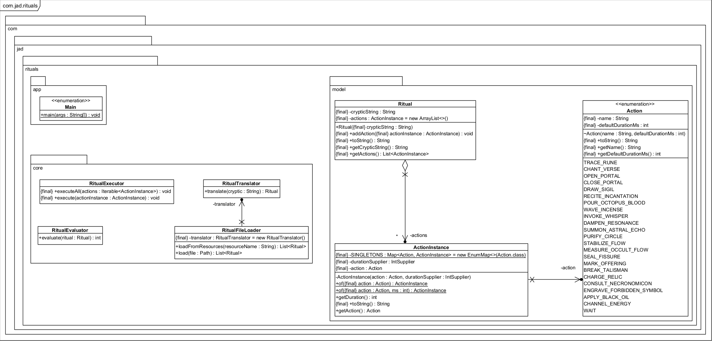

# Cryptic Rituals

# Made with ❤️ by [JAD](mailto:jeanaymeric@gmail.com)

## Diagramme de classes initial

## Règles de traduction de la chaîne cryptique en rituel

La chaîne cryptique est traduite en rituel selon un ensemble de règles déterministes.  
Le traducteur lit la chaîne **par blocs de deux caractères**, et chaque paire génère une ou plusieurs actions.

---

## 1. Découpage en paires

La chaîne est parcourue de gauche à droite :

- `"Az7!k#pQ"` → `["Az", "7!", "k#", "pQ"]`
- si la longueur est impaire, le dernier caractère est ignoré
- les espaces éventuels sont ignorés

Chaque paire est ensuite traduite indépendamment.

---

## 2. Conversion d’une paire en action

Chaque paire `XY` est d’abord transformée en un **index d’action**.

### 2.1 Codes ASCII

- `c1 = ASCII(X)`
- `c2 = ASCII(Y)`

### 2.2 Formule de calcul

\[
\text{index} = (c1 + 3 \cdot c2) \bmod \text{Action.values().length}
\]

### 2.3 Sélection de l’action

\[
\text{action} = \text{Action.values()}[\text{index}]
\]

**Cette étape est toujours appliquée**, même si `Y` est un symbole spécial.  
Les symboles spéciaux modifient ensuite l’action obtenue.

---

## 3. Symboles spéciaux (optionnels)

Le second caractère `Y` peut être un symbole spécial.  
S’il ne l’est pas, **aucune modification n’est appliquée**.

### `!` → répéter l’action 2 fois

[action, action]

---

### `?` → avancer l’action

L’action doit être **placée avant la précédente**.

Règles :

- si c’est la première action → elle est placée **en dernier**
- sinon → elle est insérée juste avant l’action précédente

---

### `#` → ajouter un CHANTER_VERSET

[action, CHANTER_VERSET]

---

### `%` → ajouter un WAIT paramétré

[action, WAIT(ASCII(X))]

Le WAIT utilise la valeur ASCII du **premier caractère**.

---

## 4. Exemple complet (avec les vraies actions)

Chaîne : a!b?c#d%

Mapping ASCII :

- `'a' = 97`
- `'b' = 98`
- `'c' = 99`
- `'d' = 100`

Actions disponibles (extrait) :

- TRACE_RUNE (120 ms)
- CHANT_VERSE (200 ms)
- DRAW_SIGIL (150 ms)
- OPEN_PORTAL (500 ms)
- WAIT(x) (paramétré)

### Paire 1 : `a!`

- index = (97 + 3×33) % N = (97 + 99) % N = 196 % N  
  (N = nombre d’actions dans l’enum)
- action = Action.values()[index] → **TRACE_RUNE** (exemple)
- `!` → répéter l’action

Résultat :
[ TRACE_RUNE, TRACE_RUNE ]

### Paire 2 : `b?`

- action = CHANT_VERSE (selon l’index calculé)
- `?` → avancer l’action

Liste actuelle :
[ TRACE_RUNE, TRACE_RUNE ]

Insertion avant la précédente :
[ TRACE_RUNE, CHANT_VERSE, TRACE_RUNE ]

### Paire 3 : `c#`

- action = DRAW_SIGIL
- `#` → ajouter un CHANTER_VERSET

Résultat :
[ DRAW_SIGIL, CHANT_VERSE ]

Liste cumulée :
[ TRACE_RUNE, CHANT_VERSE, TRACE_RUNE, DRAW_SIGIL, CHANT_VERSE ]

### Paire 4 : `d%`

- action = OPEN_PORTAL
- `%` → WAIT(ASCII('d')) = WAIT(100)

Résultat :
[ OPEN_PORTAL, WAIT(100) ]

---

## 5. Résultat final

Le rituel complet est :
[ TRACE_RUNE, CHANT_VERSE, TRACE_RUNE, DRAW_SIGIL, CHANT_VERSE, OPEN_PORTAL, WAIT(100) ]

Chaque élément est une `ActionInstance`, les actions normales étant des singletons et WAIT étant paramétré.